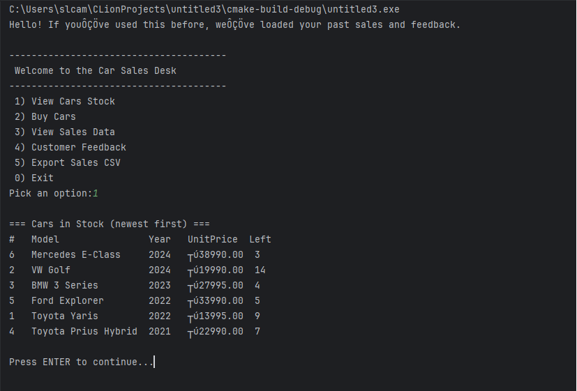

# 🚗 Car Sales Management System in C

Console-based car sales management system in C with stock tracking, file handling, and sales reporting.

---

## 📸 Screenshot

---

## 🔧 Features

- View car stock (sorted by year)
- Buy cars and update inventory
- Apply discounts automatically
- Store sales records in files
- Collect customer feedback
- Export sales data to CSV

---

## 🧠 Technologies Used

- C Programming
- Arrays & Structs
- File Handling
- CMake

---

## ▶️ How It Works

The system stores:
- Car models
- Prices
- Manufacturing years
- Stock levels

Menu options:
1. View Cars Stock  
2. Buy Cars  
3. View Sales Data  
4. Customer Feedback  
5. Export Sales CSV  
0. Exit  

---

## 💡 Skills Demonstrated

- Problem solving in C  
- Data structures (arrays & structs)  
- File input/output  
- Menu-driven application design  
- Business logic implementation  

---

## 🚀 Future Improvements

- Search functionality  
- Admin system  
- Better UI  
- Advanced reporting  
